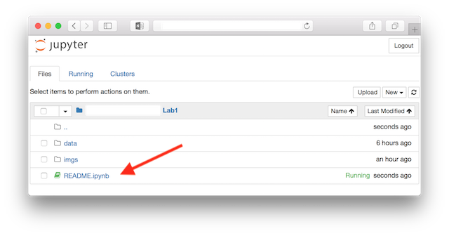



# CSCE 5380 Spring 2018 - Data Mining - Lab Assignment 1[¶](#CSCE-5380-Spring-2018---Data-Mining---Lab-Assignment-1)

## Index[¶](#Index)

*   [Objectives](#Objectives)
*   [Tools](#Tools)
*   [Installation](#Installation)
*   [Demo](#Demo)
*   [Tasks](#Tasks)
*   [Submission](#Submission)
*   [Resources](#Resources)
*   [References](#References)

## Objectives[¶](#Objectives)

This lab assignment includes hands-on tasks to help us get used to data analysis and some classification methods.

## Tools[¶](#Tools)

We use **Python** (either 2.7.* or 3.6.*) and **scikit-learn** to do the tasks. If you prefer other tools, please talk to the instructor or the TA.

For convenience, we choose **Anaconda**, a data science platform distributed with Python and Python libraries such as NumPy, SciPy, pandas, scikit-learn, TensorFlow, Theano, and so on. You can add more libraries or features by using its package manager named **conda**.

Anaconda also comes with **Jupyter Notebook**, which is an open-source web application to create and share documents that contain live code, equations, visualizations, and explanatory text, e.g. the document you are reading.

**Note:** Anaconda is kinda big with packages you might never need. You could alternatively install **virtualenv** (which also works on our lab computers without **sudo** permission and on [CSE student server](http://esupport.cse.unt.edu/index.php?news=1)), then install scikit-learn via **pip**. After experimentaion, you can write and upload your .ipynb files to [Github](https://github.com/blog/1995-github-jupyter-notebooks-3), Github will render the notebooks for you.

## Installation[¶](#Installation)

1.  Download Anaconda from [https://www.anaconda.com/download/](https://www.anaconda.com/download/).
2.  Install Anaconda into the directory you have write permission, e.g. your home directory.
3.  Start Anaconda Navigator. You can find it in the installation directory chosen above.   

4.  From Anaconda Navigator, launch Jupyter Notebook.   

5.  Jupyter File Explorer should show up in a browser window/tab. 
6.  Using Jupyter File Explorer, go to the directory which contains the document you are reading.
7.  Using Jupyter File Explorer, open **README.ipynb**. **Jupyter Editor** should show up in a new tab. Please **follow the next steps in Jupyter Editor** from now on.
8.  Now you should be able to interact with this document. Try to double-click on any part of it. The document consists of smaller parts called **cells**. Each cell can contain Markdown code (for descriptions) or Python code.

**Note:** Press H to see the keyboard shortcuts, you will need them.

## Demo[¶](#Demo)

### Know your current working directory[¶](#Know-your-current-working-directory)

It's always good to know where we are. Double-click the cell with Python code below, then press Ctrl-Enter to run it.

In [ ]:

<pre>import os
print(os.getcwd())
</pre>

### Import data from file[¶](#Import-data-from-file)

There are some [small datasets](http://scikit-learn.org/stable/datasets/index.html) already bundled with scikit-learn. You can also find some example datasets from the [Weka collections](http://www.cs.waikato.ac.nz/ml/weka/datasets.html) or the [UCI Repository](http://archive.ics.uci.edu/ml/index.php). The datasets can be stored in different formats, e.g. [ARFF](http://www.cs.waikato.ac.nz/ml/weka/arff.html), CSV, JSON, or SQL files.

In the following example, we load the Iris Plants Database from an ARFF file.

In [ ]:

<pre>from scipy.io.arff import loadarff
with open("data/iris.arff", "r") as f:
    data, meta = loadarff(f)
</pre>

Let's see the description of the dataset:

In [ ]:

<pre>print(meta)
</pre>

Let's have a look at the data points:

In [ ]:

<pre>print("There are %d data points:" % (data.size))
print(data)
</pre>

Prepare the features:

In [ ]:

<pre>X = data[meta.names()[:-1]]
print(X)
</pre>

We have an array contains the features, how about the data types of its elements?

In [ ]:

<pre>print(X.dtype)
</pre>

Many scikit's model implementations don't support these complex types **(<feature label>, <feature type>)**. We need to convert the data type of every element into **float** as we know it.

In [ ]:

<pre>import numpy as np
X = np.asarray(X.tolist(), dtype=np.float_)
print(X.dtype)
</pre>

Phew! Let's prepare the labels (outputs):

In [ ]:

<pre>Y = data[meta.names()[-1]]
print(Y)
</pre>

### Modeling[¶](#Modeling)

Assuming the features are conditionally independent, we can use a Naïve Bayes classifier. Furthermore, those are real valued features; so if we assume the likelihood of the features follow normal (Gaussian) distributions, we can use a Gaussian Naïve Bayes classifier.

In [ ]:

<pre>from sklearn.naive_bayes import GaussianNB
gnb = GaussianNB()
</pre>

### Cross-validation[¶](#Cross-validation)

Assuming that the data is independent and identically distributed (which is rarely found in practice), let's do 4-fold cross-validation.

In [ ]:

<pre>from sklearn.model_selection import cross_val_score
scores = cross_val_score(gnb, X, Y, cv=4)
print(scores)
</pre>

## Tasks[¶](#Tasks)

You are recommended to create a notebook for each task.

### Task 1[¶](#Task-1)

Run two classification algorithms--Naïve Bayes (NB) and Random Forest (RF)--on the [Primate splice-junction gene sequences](data/splice.arff).

#### Problem 1: Cross-validation[¶](#Problem-1:-Cross-validation)

Run the Naïve Bayes classifier by 3 different numbers of folds (for example, do 3 different runs by 5, 10, 15 folds in each run respectively).

Now, run the Random Forest classifier by selecting the same number of folds selected for the Naïve-Bayes classsifer (for example, if you selected 5, 10, 15 folds for Naïve-Bayes, use the same 3 numbers for Random Forest).

1.  Do the number of folds have any correlation with the number and percentage of correctly classified instances within the same model (For example, 5 folds and 10 folds in NB and RF respectively)? Explain the results.

2.  Do the same number of folds when applied to different models have any effect on the number and percentage of correctly classified instances (For example, 5 folds and 10 folds in NB and RF)? Explain the results.

3.  Select 1 set of results generated for each classifier. For example, if you performed a test by selecting 10 folds, select the results you obtained for 10 folds for both–NB and RF. Considering all classes in the dataset; calculate the accuracy and error rate for the results of NB and RF. Show the formula and explain the steps in calculating the accuracy and error-rate. **Hint**: compute the values of the confusion matrix first.

#### Problem 2: Percentage Split[¶](#Problem-2:-Percentage-Split)

Run the NB classifier by selecting 3 different percentages of training data (for example, run 3 different runs by selecting a testing-training split of 40%-60%, 55%-45%, 65%-35%, etc. in each run).

Run the RF classifier by selecting the same set of training set ratios selected for the NB classifier. Does the percentage of training data affect the classifier accuracy?

1.  Does the percentage of training data affect the classifier accuracy? How and why?

2.  If the same percentage of testing data is used for both classifiers (e.g. 40% for both NB and RF, does the classification accuracy vary from one classifier to another? Why?

3.  Select any one set of results generated for each classifier. For example, if you performed a test by selecting 40% training data, select the results you obtained for 40% for both – NB and RF. Considering all classes in the dataset, calculate the accuracy and error rate for the results of NB and RF. Show the formula and explain the steps in calculating the accuracy and error-rate.

### Task 2[¶](#Task-2)

Run two classification algorithms--Naïve Bayes (NB) and Random Forest (RF)--on the [Mushroom Database](data/mushroom.arff).

#### Problem 3: Cross-validation[¶](#Problem-3:-Cross-validation)

Run each of the NB and RF classifier once by a certain value for number of folds for cross-validation (e.g. 5 folds).

For the results obtained, generate a [ROC curve](http://scikit-learn.org/stable/auto_examples/model_selection/plot_roc.html) for the class “p” (poisonous) for both the classifiers.

#### Problem 4: Percentage Split[¶](#Problem-4:-Percentage-Split)

Run each of the NB and RF classifier once by selecting a certain percentage of training data (e.g. 40%).

For the results obtained, generate a ROC curve for the class “e” (edible) for both the classifiers.

### Task 3[¶](#Task-3)

Run the Decision Tree classifier on [Image Segmentation data](data/segment.arff), [Large Soybean Database](data/soybean.arff), and [Thyroid disease records](data/sick.arff) with a 72% and 28% split of training and test data respectively.

#### Problem 5:[¶](#Problem-5:)

Calculate and report the error-rate and accuracy for each of the datasets. Which of the 3 datasets has the highest number of correctly classified instances?

Which of the three datasets has the smallest and largest decision trees? Explain why you think the size of the decision trees varies.

## Submission[¶](#Submission)

You are encouraged to compose your answers in Jupyter using [Markdown](https://guides.github.com/pdfs/markdown-cheatsheet-online.pdf) and Python. Please put into a directory all of your notebook files (*.ipynb), source code files (*.py), together with data files (if not too big); and submit it to Blackboard.

## Resources[¶](#Resources)

Scikit-learn's rules of thumb for model choices:

*   [http://scikit-learn.org/stable/tutorial/machine_learning_map/index.html](http://scikit-learn.org/stable/tutorial/machine_learning_map/index.html)

Collections of Jupyter notebooks:

*   [https://github.com/donnemartin/data-science-ipython-notebooks#deep-learning](https://github.com/donnemartin/data-science-ipython-notebooks#deep-learning)
*   [https://github.com/jupyter/jupyter/wiki/A-gallery-of-interesting-Jupyter-Notebooks](https://github.com/jupyter/jupyter/wiki/A-gallery-of-interesting-Jupyter-Notebooks)

## References[¶](#References)

*   Fisher, R.A., "The use of multiple measurements in taxonomic problems", Annual Eugenics, 7, Part II, 179-188 (1936); also in "Contributions to Mathematical Statistics" (John Wiley, NY, 1950).
*   Eibe Frank, Mark A. Hall, and Ian H. Witten (2016). The WEKA Workbench. Online Appendix for "Data Mining: Practical Machine Learning Tools and Techniques", Morgan Kaufmann, Fourth Edition, 2016.
*   Pedregosa, F., G. Varoquaux, A. Gramfort, V. Michel, B. Thirion, O. Grisel, M. Blondel, et al. “Scikit-Learn: Machine Learning in Python.” Journal of Machine Learning Research 12 (2011): 2825–2830.

